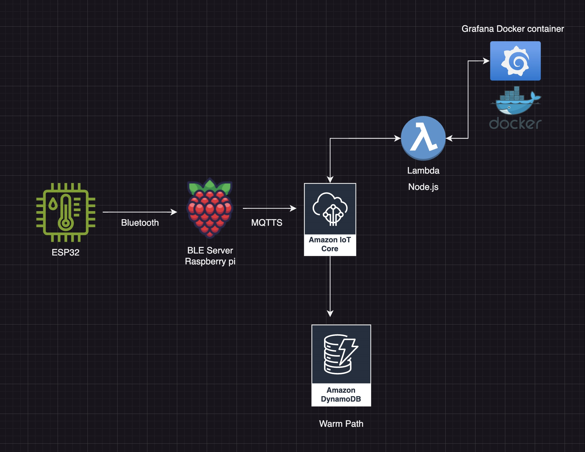

# **Portfolio Project: IoT Data Pipeline with ESP32, Raspberry Pi, AWS IoT Core, and AWS Amplify**

This project showcases the implementation of a **scalable and secure IoT data pipeline**, designed for real-time environmental monitoring and visualization. By leveraging a combination of edge devices (ESP32, Raspberry Pi) and cloud services (AWS IoT Core, DynamoDB, Lambda, AWS Amplify), this solution enables seamless **data flow, analysis, and visualization** in industrial IoT scenarios.

---

## **Table of Contents**

- [Architecture Overview](#architecture-overview)
- [Use Case](#use-case)
- [Project Components](#project-components)
- [Key Benefits](#key-benefits)
- [Setup Instructions](#setup-instructions)
- [How It Works](#how-it-works)
- [Future Improvements](#future-improvements)
- [License](#license)
- [Contributions](#contributions)

---

## **Architecture Overview**

The architecture integrates hardware and cloud components to create a real-time data pipeline:

### **Data Flow**:
1. **ESP32 → Raspberry Pi (via Bluetooth):**
   - The ESP32 collects environmental data (e.g., temperature, humidity) from connected sensors and transmits it to the Raspberry Pi over Bluetooth.

2. **Raspberry Pi → AWS IoT Core:**
   - The Raspberry Pi processes the incoming data and securely publishes it to AWS IoT Core using MQTTS.

3. **AWS IoT Core → DynamoDB:**
   - IoT Core routes the sensor data to a DynamoDB table for structured and scalable storage.

4. **DynamoDB → AWS Lambda:**
   - Lambda functions retrieve, process, and prepare the data for visualization.

5. **AWS Lambda → AWS Amplify (React Frontend):**
   - The processed data is visualized in near real-time via a React-based web application powered by AWS Amplify.

---

## **Use Case**

This solution is tailored for **Industrial IoT (IIoT)** applications, with the following key use cases:

- **Real-Time Monitoring:**
  - Track critical environmental conditions (e.g., temperature, humidity) in facilities such as warehouses, factories, and data centers.

- **Data-Driven Insights:**
  - Enable anomaly detection, real-time alerts, and data analytics for informed decision-making and preventive maintenance.

---

## **Scalability**

The architecture of this project is designed with scalability in mind, ensuring it can handle increased workloads and additional features with minimal modifications. Here’s how scalability is achieved:

1. **Modular Design**:
   - Each component (data collection, processing, storage, and visualization) is loosely coupled, making it easy to scale individual services independently.

2. **AWS IoT Core**:
   - Can handle millions of connected devices and messages simultaneously, ensuring reliable communication even with a growing number of edge devices.

3. **DynamoDB**:
   - Automatically scales storage and throughput capacity to meet demand, providing consistent low-latency performance regardless of data volume.

4. **Serverless Architecture**:
   - AWS Lambda functions scale automatically to handle varying workloads, ensuring real-time data processing without over-provisioning resources.

5. **Amplify Frontend**:
   - Hosted on AWS Amplify, the React-based application can scale seamlessly to support a larger user base with increased traffic.

6. **Horizontal Expansion**:
   - Additional edge devices (ESP32s or Raspberry Pis) can be integrated without major changes to the existing pipeline, making the system adaptable to new requirements.

7. **Global Reach**:
   - AWS’s global infrastructure ensures that data processing and visualization can be distributed across multiple regions for reduced latency and improved reliability.

---

## **Project Components**

### **Hardware**:
1. **ESP32**:
   - Gathers sensor data and transmits it to the Raspberry Pi via Bluetooth.
2. **Raspberry Pi**:
   - Serves as an intermediary for data processing and publishing to AWS IoT Core.

### **Cloud Services**:
1. **AWS IoT Core**:
   - Facilitates secure ingestion of data from edge devices.
2. **DynamoDB**:
   - Stores structured sensor data for scalable querying and analysis.
3. **AWS Lambda**:
   - Processes and formats data for visualization.
4. **AWS Amplify**:
   - Hosts the React web application for real-time data visualization.

### **Frontend**:
- **React Application**:
  - Displays dynamic visualizations and offers user-friendly interaction with the data.

---

## **Key Benefits**

1. **Modular and Scalable Architecture**:
   - Easily extendable for additional sensors, devices, or cloud services.

2. **Real-Time Data Flow**:
   - Ensures seamless monitoring and quick visualization of critical metrics.

3. **Secure and Reliable**:
   - Built on AWS's robust security framework for controlled data access and transfer.

4. **User-Friendly Frontend**:
   - Provides secure login and data insights through an intuitive interface.

---

## **Setup Instructions**

### **Prerequisites**

- **Hardware**:
  - ESP32 with connected sensors.
  - Raspberry Pi (Bluetooth-enabled).
- **AWS Services**:
  - AWS IoT Core, DynamoDB, Lambda, and Amplify.
  - IAM roles with appropriate permissions for each service.
- **Frontend**:
  - React development environment.

---

### **Steps to Set Up**

#### **1. Configure ESP32:**
- Connect sensors to the ESP32.
- Program the ESP32 to collect data and transmit it via Bluetooth.

#### **2. Set Up Raspberry Pi:**
- Install required libraries (e.g., `pybluez`).
- Write a Python script to:
  - Receive data over Bluetooth.
  - Publish data to AWS IoT Core using MQTTS.

#### **3. Configure AWS IoT Core:**
- Create an IoT "Thing" and generate certificates.
- Define IoT Core rules to route incoming data to DynamoDB.

#### **4. Create DynamoDB Table:**
- Define a table with attributes such as `timestamp`, `temperature`, `humidity` etc.

#### **5. Deploy AWS Lambda:**
- Write a Lambda function to:
  - Retrieve data from DynamoDB.
  - Format it for visualization.

#### **6. Set Up AWS Amplify:**
- Initialize an Amplify project.
- Build and deploy a React web application for real-time data visualization.

---

## **How It Works**

1. **Data Collection**:
   - The ESP32 collects sensor data and sends it to the Raspberry Pi over Bluetooth.

2. **Data Ingestion**:
   - The Raspberry Pi publishes the data to AWS IoT Core securely using MQTTS.

3. **Data Storage**:
   - IoT Core routes the incoming data to DynamoDB for persistence.

4. **Data Processing**:
   - AWS Lambda processes the stored data and prepares it for visualization.

5. **Data Visualization**:
   - The React frontend (hosted on AWS Amplify) displays the data in real-time for user interaction.

---

## **Future Improvements**

1. **Extended Sensor Support**:
   - Add compatibility for additional sensors (e.g., CO2, light, motion).

2. **Advanced Analytics**:
   - Integrate AWS Machine Learning for predictive maintenance and anomaly detection.

3. **Fault Tolerance**:
   - Enhance reliability with AWS IoT SiteWise or redundancy mechanisms.

4. **Enhanced Gateway UI**:
   - Build a GUI for Raspberry Pi to simplify configuration and monitoring.

---

## **Frontend Repository**

The frontend React application is hosted in a separate repository. You can find it [here](https://github.com/petterssonb/amplify-vite-react-template).

---

## **License**

This project is licensed under the **MIT License**. See the `LICENSE` file for details.

---

## **Contributions**

Contributions are welcome! Feel free to open issues or submit pull requests for:
- Feature enhancements.
- Bug fixes.
- Documentation improvements.

---