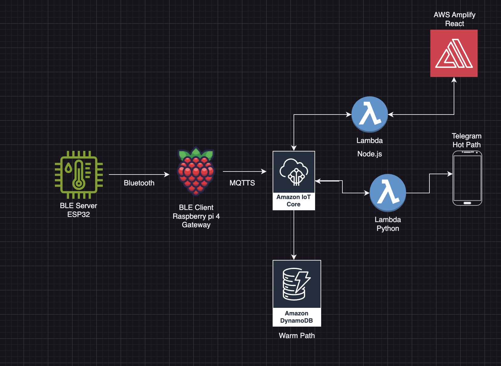

# **Portfolio Project: IoT Data Pipeline with ESP32, Raspberry Pi, AWS IoT Core, and AWS Amplify**

This project showcases the implementation of a **scalable and secure IoT data pipeline**, designed for real-time environmental monitoring and visualization. By leveraging a combination of edge devices (ESP32, Raspberry Pi) and cloud services (AWS IoT Core, DynamoDB, Lambda, AWS Amplify), this solution enables seamless **data flow, analysis, and visualization** in industrial IoT scenarios.

---

## **Table of Contents**

- [Architecture Overview](#architecture-overview)
- [Screenshots](#screenshots)
- [Purpose](#purpose)
- [Use Case](#use-case)
- [Scalability](#scalability)
- [IoT Security](#iot-security)
- [Project Components](#project-components)
- [Requirements and Design Rationale](#requirements-and-design-rationale)
- [Key Benefits](#key-benefits)
- [Setup Instructions](#setup-instructions)
  - [Prerequisites](#prerequisites)
  - [Steps to Set Up](#steps-to-set-up)
- [How It Works](#how-it-works)
- [Future Improvements](#future-improvements)
- [Frontend Repository](#frontend-repository)
- [License](#license)
- [Contributions](#contributions)

---

## **Architecture Overview**

The architecture integrates hardware and cloud components to create a real-time data pipeline and adds a **hot path alert mechanism** for real-time notifications.

### **Data Flow**:
1. **ESP32 → Raspberry Pi (via Bluetooth):**
   - The ESP32 operates as a BLE server, collecting environmental data (e.g., temperature, humidity) and broadcasting it via notifications. The Raspberry Pi, acting as a BLE client, subscribes to these notifications to receive real-time updates.

2. **Raspberry Pi → AWS IoT Core:**
   - The Raspberry Pi processes the incoming data and securely publishes it to AWS IoT Core using MQTTS.

3. **AWS IoT Core → DynamoDB (Warm Path):**
   - IoT Core routes the sensor data to a DynamoDB table for structured and scalable storage.

4. **AWS IoT Core → AWS Lambda (Hot Path):**
   - A Lambda function monitors incoming data. If a reading exceeds the threshold (24°C), it triggers an alert sent to a Telegram bot.

5. **AWS Lambda → DynamoDB → AWS Amplify (Visualization):**
   - AWS Lambda retrieves, processes, and prepares the data from DynamoDB for visualization.

6. **AWS Lambda → Telegram Bot (Alert Notifications):**
   - The alert-generating Lambda sends a notification to the Telegram bot when a temperature threshold is crossed.

---

## **Screenshots**

Click [here](content/README.md) to view the screenshots of the nodes (e.g., Raspberry Pi, Frontend)

---

## **Purpose**

The primary goal of this project is to deliver a **streamlined and cost-effective IoT solution** tailored for real-time environmental monitoring. Each design decision was carefully considered to meet specific use case requirements while balancing functionality, scalability, and operational efficiency. 

### **Why DynamoDB only for Storage Instead of S3 Buckets and/or cold storage?**

- **Temporary Data Needs**: The monitored data (e.g., temperature, humidity) is only relevant for short-term analysis and insights, as it is refreshed daily to keep the system optimized and clutter-free. A cold storage solution like S3 would be excessive for this use case since historical data retention is unnecessary.
- **Simplified Storage Architecture**: Using DynamoDB ensures structured, real-time querying and quick deletion of old data, streamlining data management while keeping the database current with only the most recent records.

### **Why the Frontend Manages Offline/Online Status?**

- **Cost Efficiency**: Implementing online/offline status and device alerting logic in the frontend reduces reliance on additional backend resources or complex database logic, lowering AWS service costs.
- **Real-Time Responsiveness**: By handling connectivity status and alert mechanisms directly in the React application, users benefit from faster updates and a seamless interface, minimizing latency from backend interactions.
- **Alerts**: By also handling the alerts in the frontend based on the timer of the offline status, the solution eliminates the need for additional backend processing, further reducing operational costs.
- **Scalable Architecture**: This approach offloads computation from the backend, ensuring the system remains lightweight and scalable while maintaining robust functionality for monitoring device states.

### **Why Send the Latest Temperature as an Alert When a Threshold Is Met?**

- **Critical Information Delivery**: In industrial and scientific environments, temperature-sensitive materials and experiments require constant monitoring to prevent catastrophic losses. By integrating a real-time alerting mechanism, critical temperature thresholds can immediately trigger alerts to designated personnel, ensuring timely intervention.

- **Preventing Catastrophic Losses**: This feature was inspired by a real-world incident at the Karolinska Institute in Sweden, where a freezer failure during the holiday period caused a temperature rise, destroying invaluable biological research materials, including blood and other sensitive samples. Due to delays in alerting the responsible teams, critical action was not taken in time, resulting in irreparable damage to years of research and impacting hundreds of scientists' careers. [Read more about the incident here](https://www.svt.se/nyheter/lokalt/stockholm/fryshaveri-pa-ki-aratal-av-forskning-forstord).

- **Efficient Monitoring**: By only sending alerts when a critical threshold is breached, the system ensures that users are not overwhelmed with constant updates but are immediately notified of actionable conditions. This reduces the cognitive load on monitoring teams while still providing essential information when it matters most.

- **Timely Action**: Real-time alerts ensure that corrective measures can be taken before a situation escalates, mitigating potential risks to experiments, equipment, and overall operations. This approach enhances reliability and fosters confidence in automated environmental monitoring systems.

---

## **Use Case**

This solution is tailored for **Industrial IoT (IIoT)** applications, with the following key use cases:

- **Real-Time Monitoring:**
  - Track critical environmental conditions (e.g., temperature, humidity) in facilities such as warehouses, factories, and data centers.

- **Data-Driven Insights:**
  - Enable anomaly detection, real-time alerts, and data analytics for informed decision-making and preventive maintenance.

---

## **Scalability**

The architecture of this project is designed with scalability in mind, ensuring it can handle increased workloads and additional features with minimal modifications. Here’s how scalability is achieved:

1. **Modular Design**:
   - Each component (data collection, processing, storage, and visualization) is loosely coupled, making it easy to scale individual services independently.

2. **AWS IoT Core**:
   - Can handle millions of connected devices and messages simultaneously, ensuring reliable communication even with a growing number of edge devices.

3. **DynamoDB**:
   - Automatically scales storage and throughput capacity to meet demand, providing consistent low-latency performance regardless of data volume.

4. **Serverless Architecture**:
   - AWS Lambda functions scale automatically to handle varying workloads, ensuring real-time data processing without over-provisioning resources.

5. **Amplify Frontend**:
   - Hosted on AWS Amplify, the React-based application can scale seamlessly to support a larger user base with increased traffic.

6. **Horizontal Expansion**:
   - Additional ESP32 devices can be added as independent BLE servers, each broadcasting sensor data. Gateways such as Raspberry Pis can act as BLE clients subscribing to these servers. This architecture supports seamless scaling by adding new ESP32 servers or Raspberry Pi gateways without modifying existing BLE communication logic.

7. **Global Reach**:
   - AWS’s global infrastructure ensures that data processing and visualization can be distributed across multiple regions for reduced latency and improved reliability.

---

## **IoT Security**

To ensure secure data flow throughout the pipeline, the following measures have been implemented:

- **Communication Security:**
  - **MQTTS:** Secure MQTT protocol with TLS encryption for data transfer between Raspberry Pi and AWS IoT Core.
  - **Bluetooth Pairing:** The ESP32 operates as a BLE server, broadcasting sensor data via notifications, and the Raspberry Pi acts as a BLE client, subscribing to these notifications. Secure pairing ensures that only authorized clients (e.g., the Raspberry Pi) can subscribe to the ESP32's data, preventing unauthorized access.

- **Cloud Security:**
  - **IAM Roles:** AWS services are accessed through IAM roles with the principle of least privilege.
  - **Encryption:** DynamoDB stores data with default encryption enabled, and Lambda functions access data through encrypted endpoints.
  - **Certificate Management:** AWS IoT Core uses X.509 certificates for mutual authentication of connected devices.

- **Physical Security:**
  - The Raspberry Pi and ESP32 are configured with minimal open ports and require authentication for physical access.

---

## **Project Components**

### **Hardware**:
1. **ESP32**:
   - Gathers sensor data and acts as a BLE server, broadcasting this data via notifications.
2. **Raspberry Pi**:
   - Operates as a BLE client, subscribing to the ESP32’s notifications. It processes the received data and securely publishes it to AWS IoT Core.

### **Cloud Services**:
1. **AWS IoT Core**:
   - Facilitates secure ingestion of data from edge devices.
2. **DynamoDB**:
   - Stores structured sensor data for scalable querying and analysis.
3. **AWS Lambda (Hot Path)**:
   - Monitors incoming data for threshold breaches and triggers alerts.
4. **AWS Lambda (Alert Watcher)**:
   - Scheduled function that verifies recent measurements and ensures timely alerts.
5. **AWS Amplify**:
   - Hosts the React web application for real-time data visualization.

### **Alerting Mechanism**:
1. **Threshold Logic**:
   - The Hot Path Lambda checks if the temperature exceeds 24°C. If so, an alert is sent.
2. **Telegram Integration**:
   - Alerts are sent to a pre-configured Telegram bot for real-time notifications.

---

## **Requirements and Design Rationale**

This solution was designed to address the following requirements:

- **Organizational Need:** Real-time monitoring of environmental conditions in industrial facilities to prevent downtime and improve operational efficiency.

- **Design Focus:** 
  - **High Security:** Ensures confidentiality, integrity, and availability of data through end-to-end encryption, access control, and physical safeguards.
  - **Scalability:** Supports growing workloads and additional devices without significant redesign.
  - **Modularity:** Allows easy integration of new components or sensors as the use case evolves.

- **Security Measures:** 
  - **Data Integrity:** Ensured through encryption at rest and in transit.
  - **Device Authentication:** Achieved through secure pairing and certificate-based access.
  - **Cloud Compliance:** Built on AWS infrastructure with adherence to industry standards for IoT security.

---

## **Key Benefits**

1. **Modular and Scalable Architecture**:
   - Easily extendable for additional sensors, devices, or cloud services.

2. **Real-Time Data Flow**:
   - Ensures seamless monitoring and quick visualization of critical metrics.

3. **Secure and Reliable**:
   - Built on AWS's robust security framework for controlled data access and transfer.

4. **User-Friendly Frontend**:
   - Provides secure login and data insights through an intuitive interface.

---

## **Setup Instructions**

### **Prerequisites**

- **Hardware**:
  - ESP32 with connected sensors.
  - Raspberry Pi (Bluetooth-enabled).
- **AWS Services**:
  - AWS IoT Core, DynamoDB, Lambda, and Amplify.
  - IAM roles with appropriate permissions for each service.
- **Frontend**:
  - React development environment.

---

### **Steps to Set Up**

1. **Configure ESP32**:
   - Connect sensors to the ESP32.
   - Program the ESP32 to collect data and advertise it as a BLE server characteristic via notifications.

2. **Set Up Raspberry Pi**:
   - Install required libraries (e.g., `pybluez`).
   - Write a Python script to:
     - Act as a BLE client subscribing to the ESP32’s notifications.
     - Process the received data and securely publish it to AWS IoT Core using MQTTS.

3. **Configure AWS IoT Core**:
   - Create an IoT "Thing" and generate certificates.
   - Define IoT Core rules to route incoming data to DynamoDB.

4. **Create DynamoDB Table**:
   - Define a table with attributes such as `timestamp`, `temperature`, `humidity`.

5. **Deploy AWS Lambda**:
   - Write a Lambda function to:
     - Process incoming data for alerts.
     - Send alerts to Telegram.

6. **Set Up Telegram Bot**:
   - Create a bot using the Telegram Bot API and obtain an access token.
   - Configure the bot endpoint in the Lambda function.

7. **Set Up AWS Amplify**:
   - Initialize an Amplify project.
   - Build and deploy a React web application for real-time

---

## **How It Works**

1. **Data Collection**:
   - The ESP32 collects sensor data and operates as a BLE server, advertising this data via notifications. The Raspberry Pi, acting as a BLE client, subscribes to the ESP32’s notifications to receive real-time updates.

2. **Data Ingestion**:
   - The Raspberry Pi publishes the data to AWS IoT Core securely using MQTTS.

3. **Data Storage**:
   - IoT Core routes the incoming data to DynamoDB for persistence.

4. **Data Processing**:
   - AWS Lambda processes the stored data and prepares it for visualization.

5. **Data Visualization**:
   - The React frontend (hosted on AWS Amplify) displays the data in real-time for user interaction.

6. **Alerts**:
   - Telegram alerts are sent by a bot triggered by a scheduled Lambda, which checks temperature thresholds before notifying users.

---

## **Future Improvements**

1. **Extended Sensor Support**:
   - Add compatibility for additional sensors (e.g., CO2, light, motion).

2. **Advanced Analytics**:
   - Integrate AWS Machine Learning for predictive maintenance and anomaly detection.

3. **Fault Tolerance**:
   - Enhance reliability with AWS IoT SiteWise or redundancy mechanisms.

4. **Enhanced Gateway UI**:
   - Build a GUI for Raspberry Pi to simplify configuration and monitoring.

5. **Status**:
   - Make Database handle state instead of frontend for alerts.
   - Also make the status visible of the gateway, in this case Raspberry Pi.

6. **Customizable Alert Thresholds**:
   - Enable users to set and adjust temperature thresholds dynamically through the frontend, allowing flexibility for different use cases.

7. **Alert Escalation Mechanism**:
   - Implement a multi-tiered alert system (e.g., Telegram, email, SMS) to ensure critical notifications reach the appropriate stakeholders through multiple channels.

8. **Historical Data Visualization**:
   - Integrate a feature to visualize historical data trends, even if temporarily stored, to identify patterns or anomalies over time.

9. **Integration with Third-Party Monitoring Tools**:
   - Connect the pipeline with third-party tools like Grafana, Datadog, or Splunk for enhanced monitoring and visualization capabilities.

10. **Edge Computing Optimization**:
    - Perform preliminary data filtering and threshold checks directly on the Raspberry Pi to reduce cloud-side processing and latency.

11. **Data Archiving**:
    - Add support for optional cold storage (e.g., AWS S3) to archive older data for long-term analysis without impacting current database performance.

12. **Geofencing Alerts**:
    - Incorporate geolocation data (e.g., GPS-enabled sensors) to trigger location-based alerts, enabling targeted responses in large facilities.

13. **Multi-Tenant Support**:
    - Develop support for multiple users or organizations, with individual alert configurations, dashboards, and permissions.

14. **Energy Efficiency Monitoring**:
    - Expand the system to track energy consumption of devices or facilities, providing additional insights for operational efficiency.

15. **Custom Alert Messages**:
    - Allow administrators to configure custom messages or conditions for alerts, enhancing clarity and usability.

16. **Mobile App Integration**:
    - Create a mobile application for real-time monitoring and alerts, enabling easy access and management from anywhere.

17. **Voice Assistant Integration**:
    - Add compatibility with voice assistants (e.g., Alexa, Google Assistant) for hands-free monitoring and notifications.

18. **AI-Powered Predictive Alerts**:
    - Leverage AI/ML models to predict potential equipment failures or anomalies before they occur, based on historical and real-time data.

19. **Global Deployment Support**:
    - Enhance the system for seamless deployment across multiple regions, with localized alerting and monitoring capabilities.

---

## **Frontend Repository**

The frontend React application is hosted in a separate repository. You can find it [here](https://github.com/petterssonb/amplify-vite-react-template).

[Go back to the top](#portfolio-project-iot-data-pipeline-with-esp32-raspberry-pi-aws-iot-core-and-aws-amplify)

---

## **License**

This project is licensed under the **MIT License**. See the `LICENSE` file for details.

---

## **Contributions**

Contributions are welcome! Feel free to open issues or submit pull requests for:
- Feature enhancements.
- Bug fixes.
- Documentation improvements.

---