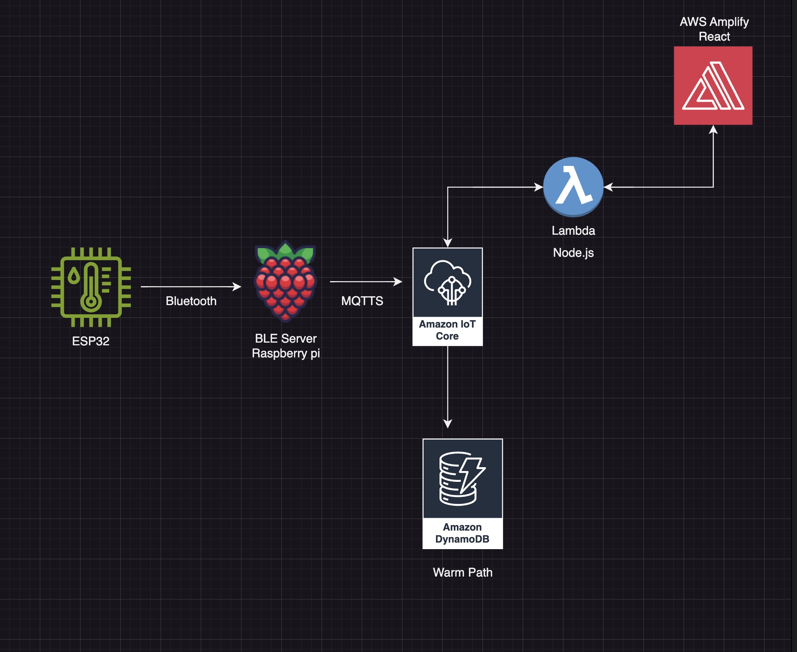

## Portfolio Project: IoT Data Pipeline with ESP32, Raspberry Pi, AWS IoT Core and AWS Amplify

This project demonstrates the implementation of a scalable and secure IoT data pipeline, focusing on real-time environmental monitoring and visualization. The architecture integrates an ESP32, Raspberry Pi, AWS IoT Core, DynamoDB, Lambda and AWS Amplify with a React frontend, enabling real-time data flow, analysis, and visualization.

### Table of Contents

- [Architecture Overview](#architecture-overview)
- [Use Case](#use-case)
- [Project Components](#project-components)
- [Key Benefits](#key-benefits)
- [Setup Instructions](#setup-instructions)
- [How It Works](#how-it-works)
- [Future Improvements](#future-improvements)
- [License](#license)
- [Contributions](#contributions)

## Architecture Overview

### Data Flow:

1.	ESP32 → Raspberry Pi (via Bluetooth):
   -	The ESP32 collects environmental data (e.g., temperature, humidity) from sensors and transmits it to the Raspberry Pi using Bluetooth.

2.	Raspberry Pi → AWS IoT Core:
  - The Raspberry Pi processes incoming data and publishes it to AWS IoT Core for secure ingestion.

3.	AWS IoT Core → DynamoDB:
  -	IoT Core rules or processing functions route the data to DynamoDB for structured storage.

4.	DynamoDB → Lambda:
  - Lambda retrieves data from the database and formats it.
	
5.	Lambda → AWS Amplify (React Frontend):
 - The processed data is made available to AWS Amplify, which powers a React-based web application for real-time visualization and user interaction.

## Use Case

This project serves Industrial IoT (IIoT) scenarios, specifically for:
	
 - Real-Time Monitoring: Track environmental conditions such as temperature and humidity in warehouses, factories, and industrial facilities.
	
 - Data-Driven Insights: Enable anomaly detection and alert configurations for proactive decision-making and preventive maintenance.

## Project Components

1.	ESP32:
 - Collects sensor data and sends it to the Raspberry Pi via Bluetooth.

2.	Raspberry Pi:
 - Acts as an intermediary between the ESP32 and AWS IoT Core.
 - Runs a Bluetooth service and publishes sensor data to AWS.

3.	AWS IoT Core:
 - Provides secure ingestion and routing of data from the Raspberry Pi to AWS services.

4.	DynamoDB:
 - Stores sensor data in a structured format, enabling further processing.

5.	AWS Lambda:
 - Processes data from DynamoDB and prepares it for visualization.

6.	AWS Amplify / React:
 - Visualizes processed data in near real-time.

## Key Benefits

  ### Modular and Scalable:
 - Independent components can be scaled or modified as needed.
 - Real-Time Data Flow:
 - Ensures quick processing and visualization of sensor data.
 - Secure and Reliable:
 - Utilizes AWS services for secure data transfer and controlled access.
 - Secure visualization through account creation and login screen.

## Setup Instructions

### Prerequisites

- ***Hardware***:
 - ESP32 with sensors
 - Raspberry Pi
 - AWS Services:
 - AWS IoT Core, DynamoDB, Lambda
 - IAM roles with appropriate permissions
 - Visualization Tools:
 - AWS Amplify

***Steps***:

 1.	ESP32 Configuration:
 - Connect sensors to the ESP32.
 - Configure Bluetooth communication.
  
2.	Raspberry Pi Setup:
 - Install necessary libraries (pybluez, submodules).
 - Set up a script to receive Bluetooth data and publish it to AWS IoT Core.

3.	AWS IoT Core:
 - Create a Thing and configure certificates.
 - Set up IoT Core rules to route data to DynamoDB.

4.	DynamoDB Table:
 - Create a table to store sensor data with attributes like timestamp, temperature, and humidity.

5.	AWS Lambda:
 - Write a function to process DynamoDB and forward data to Grafana.

6.	AWS Amplify:
 - Configure a AWS Amplify template and configure it.

## How It Works

 1.	The ESP32 collects sensor readings (e.g., temperature, humidity) and sends them to the Raspberry Pi over Bluetooth.

 2.	The Raspberry Pi publishes the data to AWS IoT Core using MQTTS.

 3.	AWS IoT Core routes the data to a DynamoDB table using IoT rules.
 
 4.	Lambda trigger DynamoDB contents

 5.	The processed data is sent to Amplify for visualization in near real-time.

## Future Improvements

 - Add support for more sensors and data types.
 - Incorporate AWS Machine Learning services for predictive analytics.
 - Improve fault tolerance and redundancy using AWS IoT SiteWise or similar services.
 - UI for the gateway part.

## License

This project is licensed under the ***MIT License***. See the ***LICENSE*** file for details.

## Contributions

Contributions are welcome! Please open an issue or submit a pull request for enhancements or bug fixes.
