# Program Screenshots

## This section contains various screenshots showcasing the program.

## ESP32 setup for portable use of the temp sensor

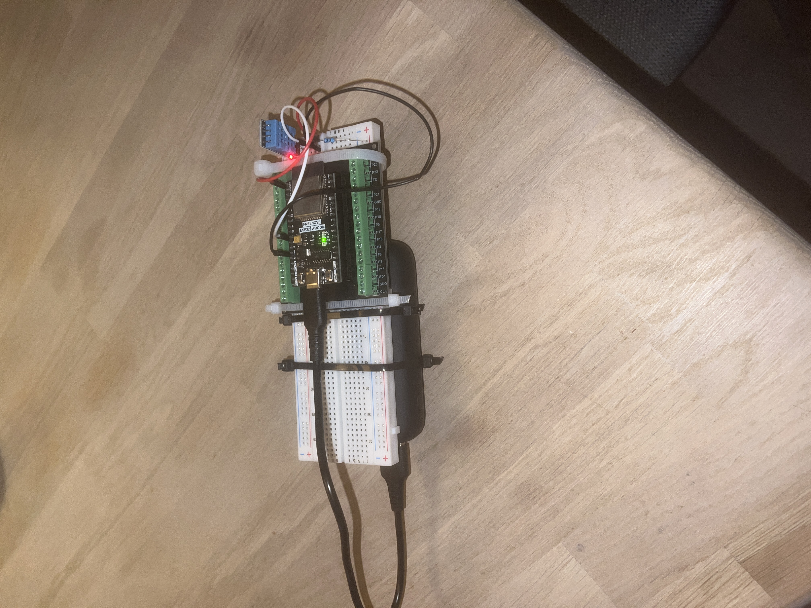

---

## Rpi connecting to ESP32 / ESP32 sending notification

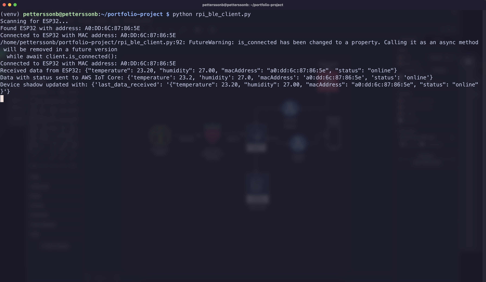

---

## Create Account UI

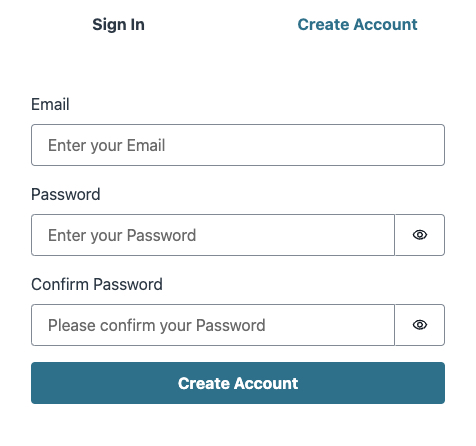

---

## Sign in UI

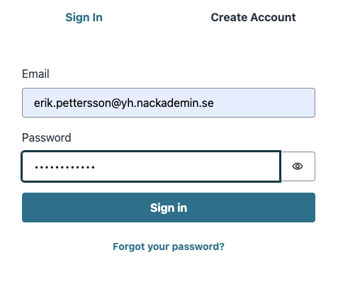

---

## Graphs while device is offline

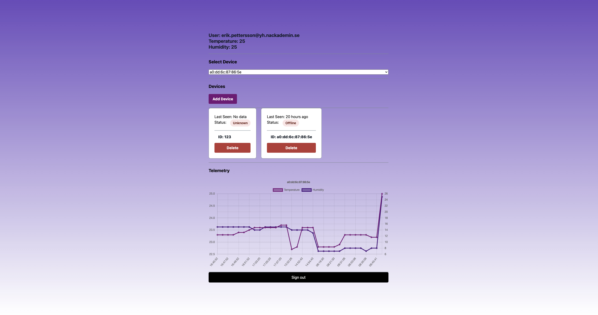

---

## Graphs while device has not sent any data

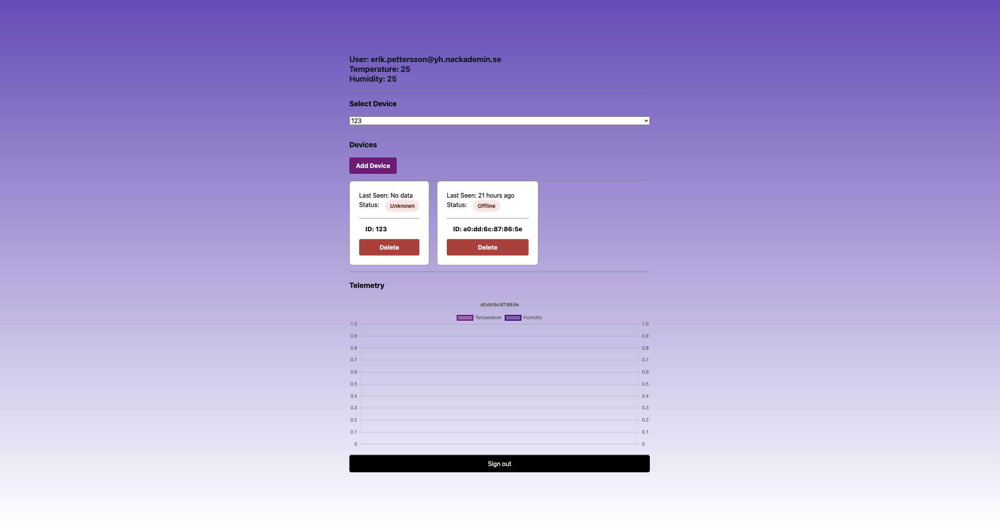

---

## Graphs while device is sending data

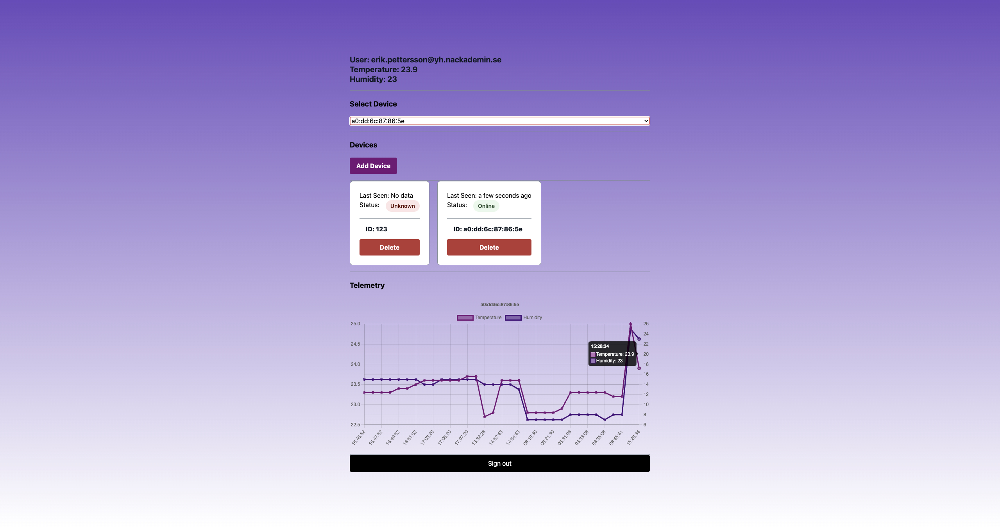

## Telegram temperature threshold acceeded alerts

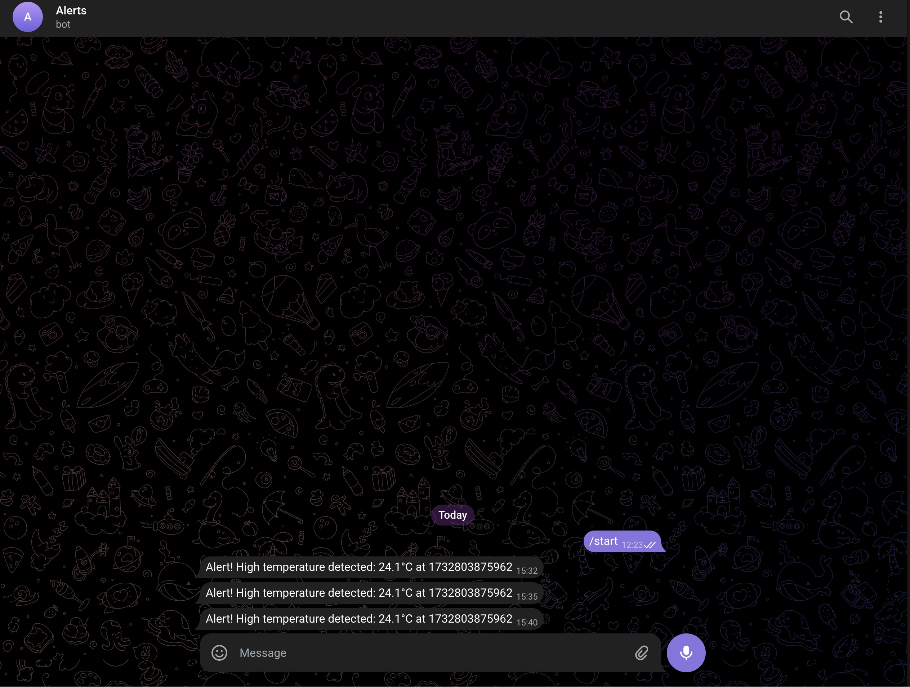

## Device goes from online to offline alert

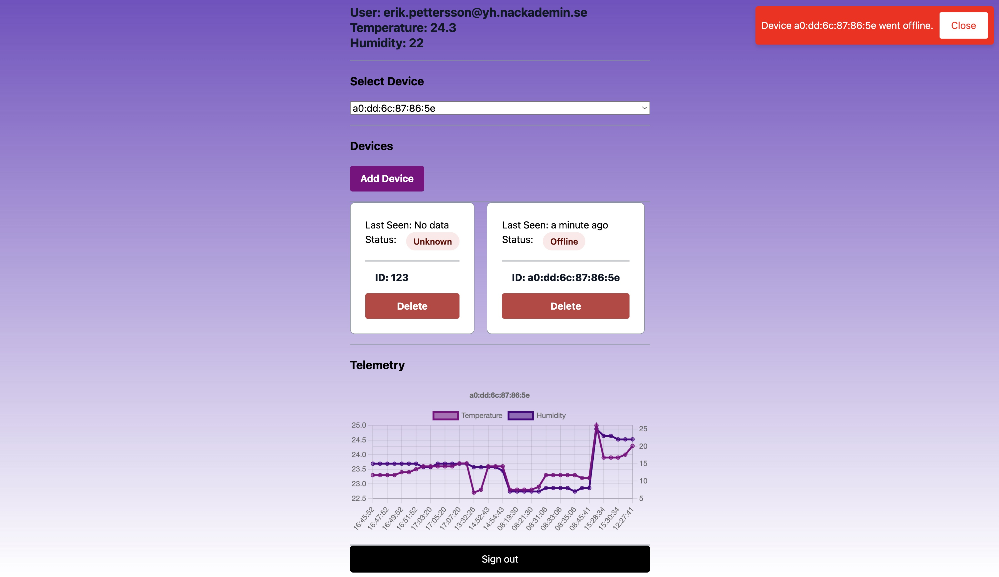

## Telegram notification when device goes from online to offline alert

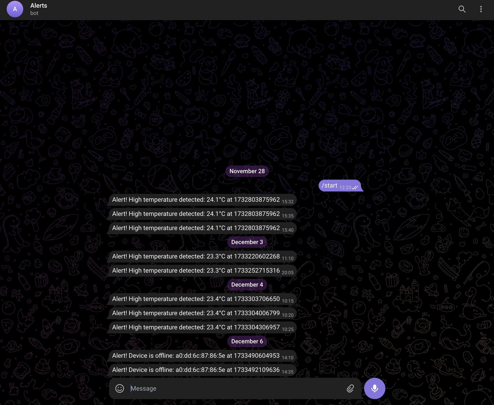

## Different user cannot see the same devices

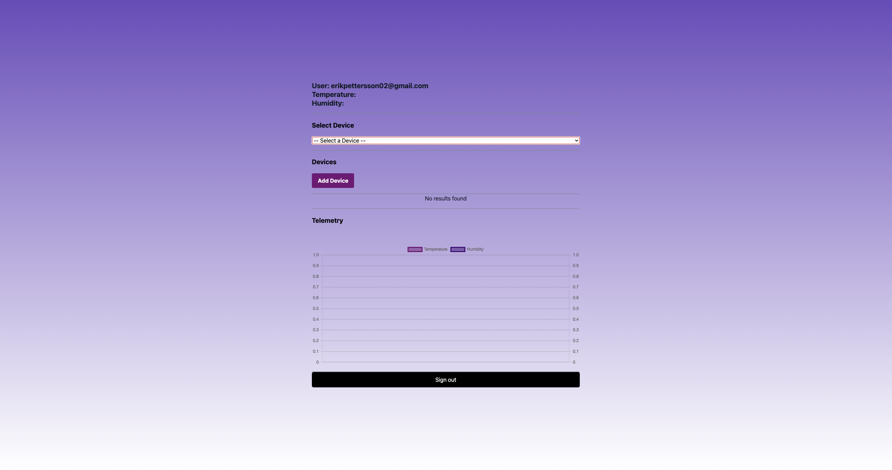